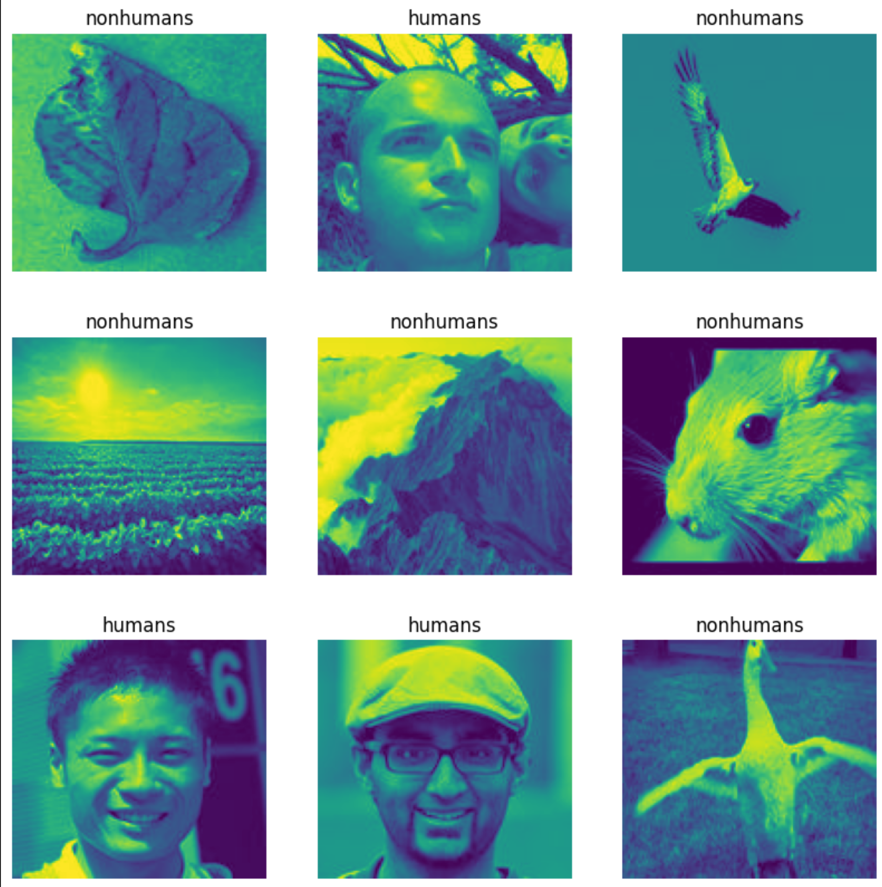
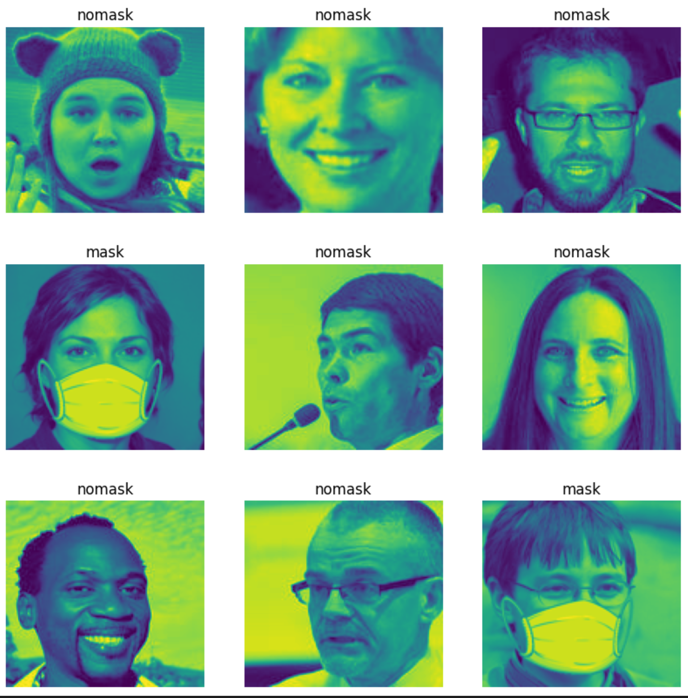
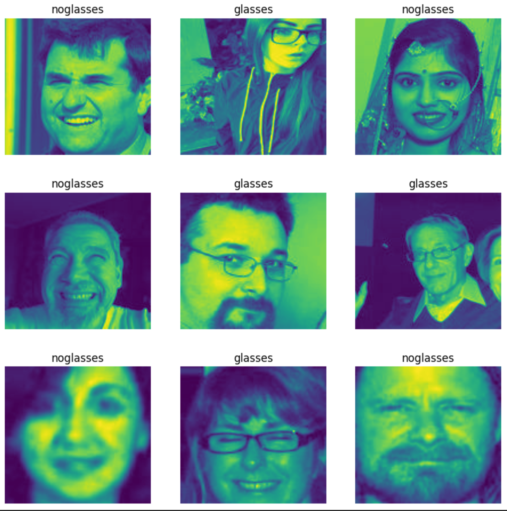

# Team HAPN Using Deep Learning Keras Model to Identify Various Tasks in Human and Nonhuman Image Data

---

#### University of Washington Bothell - Fall 2022
#### Course 581A
#### Members: Hameeda Fatima, Angelo Williams, Paul Lee, Noura Alroomi

---

### Training with Human vs. Nonhuman Task

#### Classifications: Human / Nonhuman

##### Human dataset based on factors around a human facial image from variety of angles, shades, lighting, features, etc.

##### Nonhuman dataset based on factors such as environmental contexts, artifacts, biological similarities, and arbitrary nonliving objects such as clouds, rocks, and food. 

The dataset roughly contains 10,000 randomly-named images:

- 8,000 animals
- 2,000 vehicles
- 2,000 furniture
- 2,000 plants
- 2,000 rocks
- 2,000 food
- 2,000 natural scenes (landscapes)

---

### Training with Humans with Masks vs. No Mask Task

#### Classifications: Mask / No Mask

##### Mask dataset based on human faces with masks, either artificially or naturally rendered on the image of the face

##### No Mask dataset based on factors around a human facial image from variety of angles, shades, lighting, features, etc.

---

### Trianing with Humans with Glasses vs. No Glasses Task

#### Classifications: Glasses / No Glasses

##### Glasses dataset based on human faces with glasses, either artificially or naturally rendered on the image of the face

##### No Glasses dataset based on factors around a human facial image from variety of angles, shades, lighting, features, etc.

